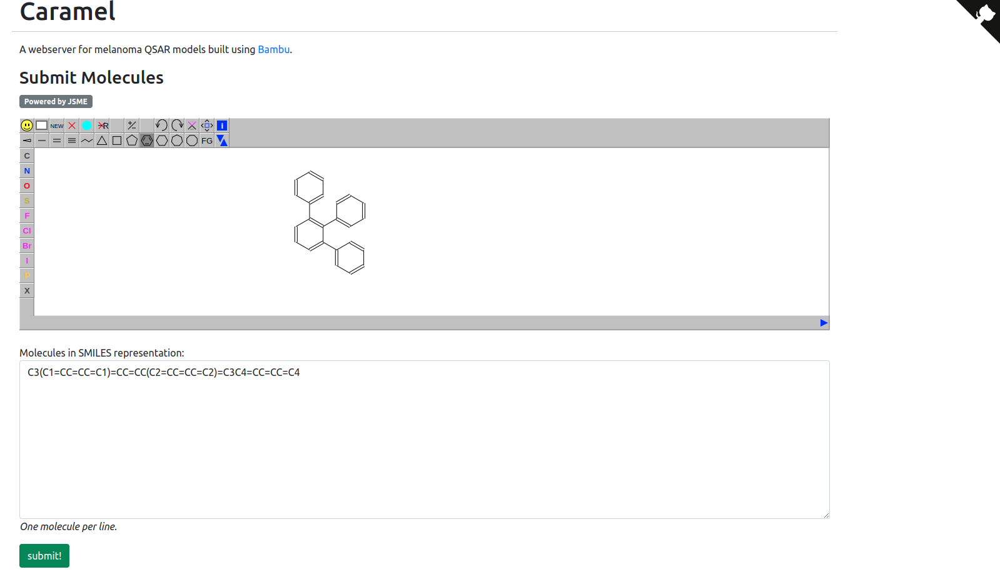

# Caramel

[](https://doi.org/10.5281/zenodo.10406050)

## Requirements

- [redis](https://redis.io/). The port used by Redis must be specified in the environment variable `BAMBU_REDIS_URI`.

## Setup

Installation requires a Conda distribution/implementation, such as [Anaconda](https://zenodo.org/records/10406050), [Miniconda](https://docs.conda.io/projects/miniconda/en/latest/) or [Mamba](https://github.com/mamba-org/mamba). In most cases, the installation might be performed using the command bellow:

```
$ make setup
```

Under the hood, `make` will call the conda (or mamba) `env create` or `env update` commands. A `caramel` 
Conda environment will be created.

## Datasets

Caramel datasets occupy ~1.1 Gb of space and are not appropriate for GitHub, therefore we have
uploaded them to [Zenodo](https://zenodo.org/records/10406050). To download the data, use the command:

```
$ make download_data
```

## Activating the conda environment

To run the tool, activate the conda environment and use the `make deploy` command. It will start the
web application, which by default will run on port 8080. To change it, use the `CARAMEL_PORT` argument 
in make (eg: `make deploy CARAMEL_PORT=8085` to run on port 8085)

```
$ conda activate caramel
$ make deploy
```

